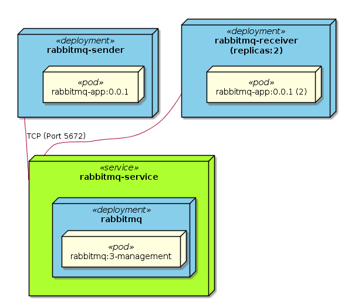
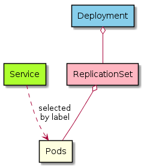

# Deploy RabbitMQ Spring Application to Kubernetes

We will deploy and test RabbitMQ server and our RabbitMQ Spring sender/receiver application to Kubernetes.



## Kubernetes setup

### Kubernetes testbed on Vagrant

```console
git clone https://github.com/xbernpa/vagrant-kubernetes-lab.git
vagrant up
```

### Docker registry

To deploy our application to Kubernetes, we must have a docker registry so that Kubernetes nodes can pull our own image.

On "k8smaster" VM, install docker registry

```console
sudo apt-get install -y docker-registry
sudo systemctl start docker-registry.service
sudo systemctl enable docker-registry.service
```

On "k8smaster" and "k8sworker" VMs, add k8smaster to /etc/hosts, make k8smaster docker registry safe and then reboot

```console
cat << EOF | sudo tee /etc/docker/daemon.json
{
  "insecure-registries":["k8smaster:5000"]
}
EOF
```

## Build and publish docker image

Build image

```console
cp code/rabbitmq-app/target/rabbitmq-app-0.0.1-SNAPSHOT.jar deployment/
cd deployment
sudo docker build -t rabbitmq-app:0.0.1 .
```

Verify image

```console
vagrant@k8smaster:~$ sudo docker images | grep rabbitmq-app
rabbitmq-app                               0.0.1               8725d593a8ef        5 minutes ago       658 MB
```

Push image to registry

```console
sudo docker tag rabbitmq-app:0.0.1 k8smaster:5000/rabbitmq-app:0.0.1
sudo docker push k8smaster:5000/rabbitmq-app:0.0.1
```

## Deploy RabbitMQ service to Kubernetes

rabbitmq-service.yml

- 1: Deployment "rabbitmq"
- 2: 1 Pod. 1 Deployment has 1 related ReplicationSet. ReplicationSet ensures  1 or more Pod to run. ReplicationSet name is generated with its Deployment name. The Pod number is defined by "replicas". If any Pod is down for system or its own reason, ReplicationSet brings Pod on same or another Kubernetes node.
- 3: Pod template. Template to create Pod. Pod name is generated with its ReplicationSet name.
- 4: Pod has 1 docker, whose image is "rabbitmq:3-management"
- 5: Pod accepts TCP request at port 5672
- 6: Service "rabbitmq-server", which accepts request at port 5672 and forwards request to label-selected Pod.

```yaml
apiVersion: apps/v1
kind: Deployment                      # 1
metadata:
  name: rabbitmq
spec:
  replicas: 1                         # 2
  selector:
    matchLabels:
      app: taskQueue
      component: rabbitmq
  template:                           # 3
    metadata:
      labels:
        app: taskQueue
        component: rabbitmq
    spec:
      containers:
      - image: rabbitmq:3-management  # 4
        name: rabbitmq
        ports:
        - containerPort: 5672         # 5
        resources:
          limits:
            cpu: 100m
---
apiVersion: v1
kind: Service                         # 6
metadata:
  name: rabbitmq-service
spec:
  selector:
    app: taskQueue
    component: rabbitmq
  ports:
  - port: 5672
```

Console output

- 1: Service "rabbitmq-service" accepts TCP request at 10.102.234.100:5672. The IP is Kubernetes overlayed network. It is reachable by Kubernetes Pod. But it is not reachable by non-Kubernetes application.
- 2: Deployment "rabbitmq"
- 3: ReplicationSet "rabbitmq-6c45c46587". It is generated with Deployment name as prefix
- 4: Pod "rabbitmq-6c45c46587-gs6q5". It is generated with ReplicationSet name as prefix

```console
vagrant@k8smaster:~/rabbitmq/deployment$ sudo kubectl create -f rabbitmq-service.yml
deployment.apps "rabbitmq" created
service "rabbitmq-service" created
vagrant@k8smaster:~/rabbitmq/deployment$ sudo kubectl get svc,deploy,rs,po
NAME               TYPE        CLUSTER-IP       EXTERNAL-IP   PORT(S)    AGE
kubernetes         ClusterIP   10.96.0.1        <none>        443/TCP    5d
rabbitmq-service   ClusterIP   10.102.234.100   <none>        5672/TCP   9s # 1

NAME       DESIRED   CURRENT   UP-TO-DATE   AVAILABLE   AGE
rabbitmq   1         1         1            1           9s                  # 2

NAME                  DESIRED   CURRENT   READY     AGE
rabbitmq-6c45c46587   1         1         1         9s                      # 3

NAME                        READY     STATUS    RESTARTS   AGE
rabbitmq-6c45c46587-gs6q5   1/1       Running   0          9s               # 4
vagrant@k8smaster:~/rabbitmq/deployment$
```

## Deploy RabbitMQ Application to Kubernetes

rabbitmq-app.yml

- 1: Deployment "rabbitmq-sender" and "rabbitmq-receiver"
- 2: 1 sender Pod and 2 receiver Pods
- 3: all Pods use same image from local docker registry
- 4: Pod environment variables
  - Control whether to run in sender or receiver mode
  - Send AMQP request to Kubernetes service "rabbitmq-service" deployed before
  - User and password defined in docker image "rabbitmq:3-management"

```yaml
apiVersion: apps/v1
kind: Deployment                                  # 1
metadata:
  name: rabbitmq-sender
spec:
  selector:
    matchLabels:
      app: rabbitmq-sender
  replicas: 1                                     # 2
  template:
    metadata:
      labels:
        app: rabbitmq-sender
    spec:
      containers:
      - name: rabbitmq-sender
        image: k8smaster:5000/rabbitmq-app:0.0.1  # 3
        env:                                      # 4
        - name: SPRING_PROFILES_ACTIVE
          value: "sender"
        - name: SPRING_RABBITMQ_HOST
          value: "rabbitmq-service"
        - name: SPRING_RABBITMQ_USERNAME
          value: "guest"
        - name: SPRING_RABBITMQ_PASSWORD
          value: "guest"
---
apiVersion: apps/v1
kind: Deployment                                  # 1
metadata:
  name: rabbitmq-receiver
spec:
  selector:
    matchLabels:
      app: rabbitmq-receiver
  replicas: 2                                     # 2
  template:
    metadata:
      labels:
        app: rabbitmq-receiver
    spec:
      containers:
      - name: rabbitmq-receiver
        image: k8smaster:5000/rabbitmq-app:0.0.1  # 3
        env:                                      # 4
        - name: SPRING_PROFILES_ACTIVE
          value: "receiver"
        - name: SPRING_RABBITMQ_HOST
          value: "rabbitmq-service"
        - name: SPRING_RABBITMQ_USERNAME
          value: "guest"
        - name: SPRING_RABBITMQ_PASSWORD
          value: "guest"
```

Console output

- 1: Deployment "rabbitmq-receiver", which has 1 ReplicationSet "rabbitmq-receiver-8f96d64bc", which has 2 Pods
- 2: Deployment "rabbitmq-sender", which has 1 ReplicationSet "rabbitmq-sender-55dc79c5bc", which has 1 Pod

```console
vagrant@k8smaster:~/rabbitmq/deployment$ sudo kubectl create -f rabbitmq-app.yml
deployment.apps "rabbitmq-sender" created
deployment.apps "rabbitmq-receiver" created

vagrant@k8smaster:~/rabbitmq/deployment$ sudo kubectl get svc,deploy,rs,po
NAME               TYPE        CLUSTER-IP       EXTERNAL-IP   PORT(S)    AGE
kubernetes         ClusterIP   10.96.0.1        <none>        443/TCP    5d
rabbitmq-service   ClusterIP   10.102.234.100   <none>        5672/TCP   42m

NAME                DESIRED   CURRENT   UP-TO-DATE   AVAILABLE   AGE
rabbitmq            1         1         1            1           42m
rabbitmq-receiver   2         2         2            2           9s       # 1
rabbitmq-sender     1         1         1            1           9s       # 2

NAME                          DESIRED   CURRENT   READY     AGE
rabbitmq-6c45c46587           1         1         1         42m
rabbitmq-receiver-8f96d64bc   2         2         2         9s            # 1
rabbitmq-sender-55dc79c5bc    1         1         1         9s            # 2

NAME                                READY     STATUS    RESTARTS   AGE
rabbitmq-6c45c46587-gs6q5           1/1       Running   0          42m
rabbitmq-receiver-8f96d64bc-h7zx8   1/1       Running   0          8s     # 1
rabbitmq-receiver-8f96d64bc-mtpfb   1/1       Running   0          8s
rabbitmq-sender-55dc79c5bc-jkmd4    1/1       Running   0          8s     # 2
```

Pod logs

- Sender sends messages every 1s

```console
# sender
vagrant@k8smaster:~/rabbitmq/deployment$ sudo kubectl logs --tail=5 rabbitmq-sender-55dc79c5bc-jkmd4
2018-04-16 13:58:15.954  INFO rabbitmq-sender-55dc79c5bc-jkmd4 1 --- [pool-4-thread-1] com.example.rabbitmqapp.MySender         : [x] Sent 'Hello..347'
2018-04-16 13:58:16.959  INFO rabbitmq-sender-55dc79c5bc-jkmd4 1 --- [pool-4-thread-1] com.example.rabbitmqapp.MySender         : [x] Sent 'Hello...348'
2018-04-16 13:58:17.960  INFO rabbitmq-sender-55dc79c5bc-jkmd4 1 --- [pool-4-thread-1] com.example.rabbitmqapp.MySender         : [x] Sent 'Hello.349'
2018-04-16 13:58:18.972  INFO rabbitmq-sender-55dc79c5bc-jkmd4 1 --- [pool-4-thread-1] com.example.rabbitmqapp.MySender         : [x] Sent 'Hello..350'
2018-04-16 13:58:19.974  INFO rabbitmq-sender-55dc79c5bc-jkmd4 1 --- [pool-4-thread-1] com.example.rabbitmqapp.MySender         : [x] Sent 'Hello...351'
```

- After one reciver rejects "456", another receiver proceeds it from RabbitMQ

```console
# sender
vagrant@k8smaster:~/rabbitmq/deployment$ sudo kubectl logs rabbitmq-sender-55dc79c5bc-jkmd4 | grep 456
2018-04-16 14:00:05.218  INFO rabbitmq-sender-55dc79c5bc-jkmd4 1 --- [pool-4-thread-1] com.example.rabbitmqapp.MySender         : [x] Sent 'Hello...456'

# receiver 1
vagrant@k8smaster:~/rabbitmq/deployment$ sudo kubectl logs rabbitmq-receiver-8f96d64bc-h7zx8 | grep "456"
2018-04-16 14:00:05.320 ERROR rabbitmq-receiver-8f96d64bc-h7zx8 1 --- [cTaskExecutor-1] com.example.rabbitmqapp.MyReceiver       : [x] Received Exception Hello...456

# receiver 2
vagrant@k8smaster:~/rabbitmq/deployment$ sudo kubectl logs rabbitmq-receiver-8f96d64bc-mtpfb | grep 456
2018-04-16 14:00:05.422  INFO rabbitmq-receiver-8f96d64bc-mtpfb 1 --- [cTaskExecutor-1] com.example.rabbitmqapp.MyReceiver       : [x] Received 'Hello...456'
```

## Summary

- Set up a vagrant-based Kubernetes cluster.
- Create a local docker registry, which holds our application docker image so that Kubernetes nodes can pull related images.
- In Kubernetes, 1 Deployment has 1 ReplicationSet; 1 ReplicationSet has 1 or more Pods; 1 Service accepts requests from external applications and other Pods and forwards them to label-selected Pods
- RabbitMQ server and application can run together in Kubernetes cluster
  - RabbitMQ server runs as a Kubernetes service
  - "sender" and "receiver" runs as different Kubernetes deployments with different environment variable "SPRING_PROFILES_ACTIVE"
  - Make "sender" and "receiver" Pod access RabbitMQ server by setting "sender"/"receiver" Pod environment variable SPRING_RABBITMQ_HOST to RabbitMQ server's Kubernetes service name. Kubernetes registers service name to DNS.



## Reference

- [Kubernetes Connecting Applications with Services](https://kubernetes.io/docs/concepts/services-networking/connect-applications-service/)
- [Coarse Parallel Processing Using a Work Queue](https://kubernetes.io/docs/tasks/job/coarse-parallel-processing-work-queue/)
